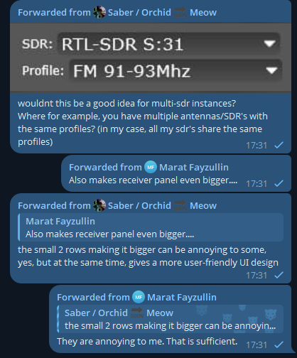

# OpenWebRX-Plugins

Small collection of plugins and helpers for OpenWebRX+.
These are not written professionally, and most likely thrown together by GPT.

## Overview

This repository contains plugins, example integrations, and utilities intended to extend or integrate with OpenWebRX. It is organized to be lightweight and easy to adapt into existing OpenWebRX deployments.

## Preview

MultiSDR Selector
This isn't a pretty plugin — it may bug out if you have an RTL-SDR that suddenly drops out (requiring a refresh), but it works!

I made this plugin because I have 4 SDRs in one OpenWebRX+ instance, on different antennas, all with the same profiles.

## Installation

- Follow the quickstart of this repo: [openwebrxplus-plugins quickstart](https://github.com/0xAF/openwebrxplus-plugins)

## Contributing

Contributions are welcome. Please open an issue or a pull request describing the change.

## Support
Use these plugins at your own risk, limited testing has been done.

## Note on some features in here
I personally thought certain features, such as a MultiSDR switch (for multi-antenna boxes without an antenna switcher), would be a neat idea, though sadly, this will not be added to the mainstream OpenWebRX.

Marat, the developer of OpenWebRX+ has stated:

> **"They are annoying to me. That is sufficient."**

## License

This project is released under the MIT License — see the `LICENSE` file for details.

Copyright (c) 2026 TGCFabian
